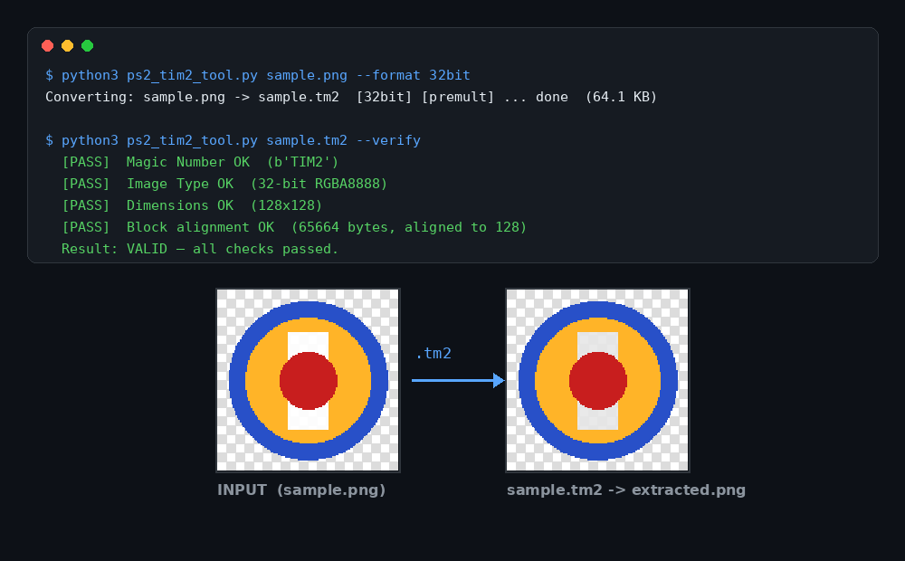
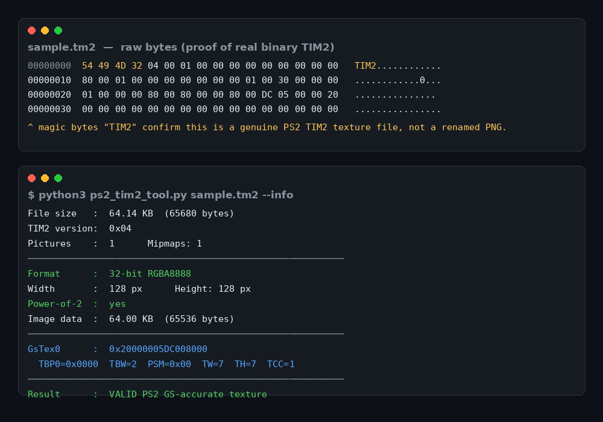

# PS2 TIM2 Tool






A complete TIM2 (`.tm2`) texture toolkit for the PlayStation 2. Convert standard images into PS2-native TIM2 textures, extract existing TIM2 files back into regular images, inspect their internal structure, and verify their integrity — all from a single command-line script.

Built for PS2 homebrew development, game modding, and texture pipeline work, with accurate handling of GS pixel formats, CLUT palettes, VRAM swizzling, and mipmap chains.

## Features

- **Image → TIM2 conversion** in five PS2 GS pixel formats: 32-bit, 24-bit, 16-bit, 8-bit indexed, and 4-bit indexed
- **TIM2 → Image extraction**, converting `.tm2` files back into common image formats
- **CLUT (palette) generation** for indexed formats, including proper 8-bit CLUT swizzling
- **GS VRAM swizzle** support for 32-bit and 16-bit formats
- **Mipmap chain generation** for all formats — 32-bit, 24-bit, 16-bit, 8-bit indexed, and 4-bit indexed
- **Alpha premultiplication**, matching PS2 GS rendering behavior (32-bit and 16-bit)
- **Floyd–Steinberg dithering** for 4-bit and 8-bit indexed output
- **Power-of-2 dimension handling**, with optional automatic resize up or down
- **Batch conversion** from wildcards or a text list file
- **`.tm2` file inspection** (`--info`) showing header, format, CLUT, and GS Tex0 data
- **`.tm2` integrity verification** (`--verify`) with a 12-point structural check

## Requirements

- Python 3
- [Pillow](https://pypi.org/project/Pillow/) (`PIL`)

Install Pillow with:

```
pip install Pillow
```

## Supported Input Image Formats

`.png` `.jpg` `.jpeg` `.bmp` `.tga` `.tiff` `.tif` `.webp` `.gif` `.ppm` `.pgm` `.pbm` `.ico` `.dds`

## Supported Output Formats (image extraction from `.tm2`)

`.png` `.jpg` `.jpeg` `.bmp` `.tga` `.tiff` `.tif` `.webp` `.ppm`

## TIM2 Output Formats

| Format | Description |
|---|---|
| `32bit` | RGBA8888 — full color + 8-bit alpha — best for textures |
| `24bit` | RGB888 — full color, no alpha — backgrounds and opaque textures |
| `16bit` | RGBA5551 — 32K colors + 1-bit alpha — smaller file size |
| `8bit`  | Indexed8 — 256 colors + CLUT — characters, environments |
| `4bit`  | Indexed4 — 16 colors + CLUT — icons, UI elements |

## Usage

### Convert an image to TIM2

```
python3 ps2_tim2_tool.py (filename) --format 32bit
```

```
python3 ps2_tim2_tool.py (filename) --format 24bit
```

```
python3 ps2_tim2_tool.py (filename) --format 16bit
```

```
python3 ps2_tim2_tool.py (filename) --format 8bit
```

```
python3 ps2_tim2_tool.py (filename) --format 4bit
```

### Convert multiple images at once

```
python3 ps2_tim2_tool.py (filename) (filename) (filename) --format 32bit
```

### Convert with dithering (4-bit / 8-bit only)

```
python3 ps2_tim2_tool.py (filename) --format 8bit --dither
```

### Convert without alpha premultiplication

```
python3 ps2_tim2_tool.py (filename) --format 32bit --no-premult
```

### Convert with a specific output file path

```
python3 ps2_tim2_tool.py (filename) --format 32bit --output (filename)
```

### Convert with a specific output directory

```
python3 ps2_tim2_tool.py (filename) --format 32bit --output-dir (directory)
```

### Resize non-power-of-2 images automatically

```
python3 ps2_tim2_tool.py (filename) --format 32bit --resize up
```

```
python3 ps2_tim2_tool.py (filename) --format 32bit --resize down
```

### Apply GS VRAM swizzle (32-bit / 16-bit only)

```
python3 ps2_tim2_tool.py (filename) --format 32bit --swizzle
```

### Generate a full mipmap chain (all formats)

```
python3 ps2_tim2_tool.py (filename) --format 32bit --mipmaps
```

### Combine multiple options

```
python3 ps2_tim2_tool.py (filename) --format 32bit --swizzle --mipmaps --resize up
```

### Convert a batch of images from a text list file

```
python3 ps2_tim2_tool.py --list (filename)
```

### Inspect an existing TIM2 file

```
python3 ps2_tim2_tool.py (filename) --info
```

### Verify the integrity of a TIM2 file

```
python3 ps2_tim2_tool.py (filename) --verify
```

### Extract a TIM2 file back into an image

```
python3 ps2_tim2_tool.py (filename) --extract png
```

```
python3 ps2_tim2_tool.py (filename) --extract jpg
```

```
python3 ps2_tim2_tool.py (filename) --extract bmp
```

```
python3 ps2_tim2_tool.py (filename) --extract tga
```

```
python3 ps2_tim2_tool.py (filename) --extract tiff
```

```
python3 ps2_tim2_tool.py (filename) --extract webp
```

```
python3 ps2_tim2_tool.py (filename) --extract ppm
```

### List all available formats and options

```
python3 ps2_tim2_tool.py --list-formats
```

## All Options

| Option | Description |
|---|---|
| `--format`, `-f` | Output format: `4bit` \| `8bit` \| `16bit` \| `24bit` \| `32bit` |
| `--output`, `-o` | Output file path (single file only) |
| `--output-dir` | Output directory for all converted files |
| `--no-premult` | Disable alpha premultiplication |
| `--dither` | Enable Floyd–Steinberg dithering (4-bit and 8-bit) |
| `--resize up` \| `down` | Resize non-power-of-2 images up or down to the nearest power of 2 |
| `--swizzle` | Apply GS VRAM swizzle to pixel data (32-bit and 16-bit only) |
| `--mipmaps` | Generate a full mipmap chain stored in the TIM2 file (all formats) |
| `--info` | Read and display info from an existing `.tm2` file |
| `--verify` | Verify the integrity of a `.tm2` file (12 checks) |
| `--list` | Convert images listed in a text file (filename + format per line) |
| `--extract` | Extract TIM2 to an image format |
| `--list-formats`, `-l` | List available formats and options |

## List File Format

When using `--list`, provide a plain text file with one entry per line, containing the filename and target format:

```
(filename) 32bit
(filename) 24bit
(filename) 16bit
(filename) 8bit
```

## Notes

- Non-power-of-2 images are still converted by default, with a warning. Use `--resize up` or `--resize down` to force power-of-2 dimensions.
- The `--swizzle` option applies only to `32bit` and `16bit` formats.
- The `--mipmaps` option applies to all five formats (`32bit`, `24bit`, `16bit`, `8bit`, `4bit`).
- The `--dither` option applies only to `4bit` and `8bit` formats.
- The `24bit` format stores no alpha channel — every pixel is fully opaque, so `--no-premult` and `--swizzle` have no effect on it.
- When extracting a TIM2 file to a format without alpha support (`.jpg`, `.bmp`, `.ppm`), transparency is composited onto a white background.

## Releases

Don't have Python installed, or just want to run the tool without setting up an environment? Check the [Releases](../../releases) page for ready-to-use executable builds — no Python or dependencies required, just download and run.

## License

This project is licensed under the [MIT License](LICENSE) — see the `LICENSE` file for details.
