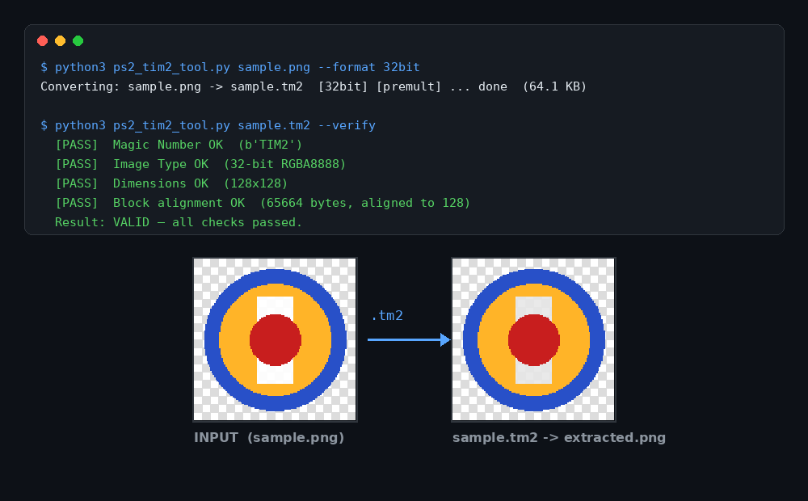
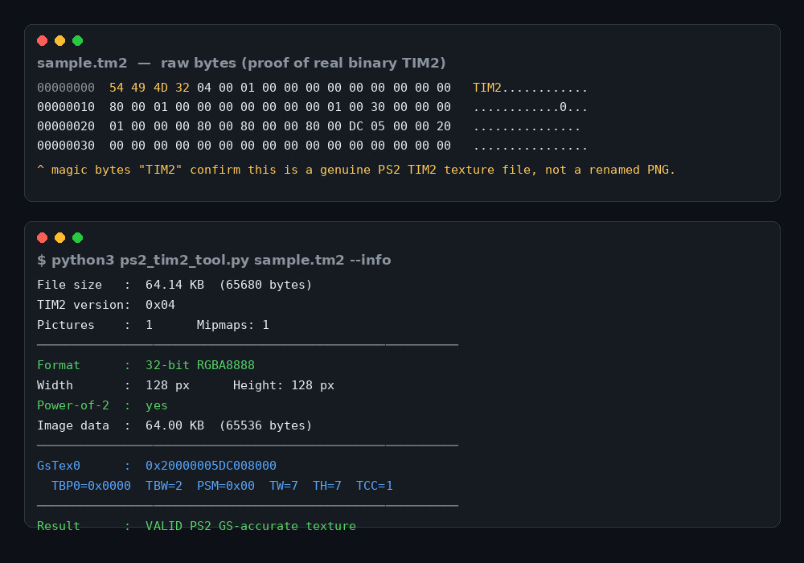

# PS2 TIM2 Tool

⭐ If this tool saved you time, consider starring the repo. It helps others find it too.





A complete TIM2 (`.tm2`) texture toolkit for the PlayStation 2. Convert standard images into PS2-native TIM2 textures, extract existing TIM2 files back into regular images, inspect their internal structure, verify their integrity, and diff two TIM2 files to check compatibility, all from the command line.

Built for PS2 homebrew development, game modding, and texture pipeline work, with accurate handling of GS pixel formats, CLUT palettes, VRAM swizzling, and mipmap chains.

The tool is available in **two implementations with the same command-line interface**:

| Implementation | Location | Best for |
|---|---|---|
| **C** (native) | [`src/c/ps2_tim2_tool.c`](src/c/ps2_tim2_tool.c) | Standalone prebuilt executables, no runtime needed, fastest |
| **Python** | [`src/py/ps2_tim2_tool.py`](src/py/ps2_tim2_tool.py) | Easy to read, modify and run anywhere Python + Pillow are available |

## Features

- **Image → TIM2 conversion** in five PS2 GS pixel formats: 32-bit, 24-bit, 16-bit, 8-bit indexed, and 4-bit indexed
- **TIM2 → Image extraction**, converting `.tm2` files back into common image formats
- **CLUT (palette) generation** for indexed formats, including proper 8-bit CLUT swizzling
- **GS VRAM swizzle** support for 32-bit and 16-bit formats
- **Mipmap chain generation** for all formats
- **Alpha premultiplication**, matching PS2 GS rendering behavior (32-bit and 16-bit)
- **Floyd–Steinberg dithering** for 4-bit and 8-bit indexed output
- **Power-of-2 dimension handling**, with optional automatic resize up or down (Lanczos)
- **Batch conversion** from wildcards or a text list file
- **`.tm2` file inspection** (`--info`) showing header, format, CLUT, and GS Tex0 data
- **`.tm2` integrity verification** (`--verify`) with a 12-point structural check
- **`.tm2` diff / compatibility check** (`--diff`) comparing an original file against a modified one (format, dimensions, file size, transparency, and pixel-level changes) with a SAFE / WARNING / UNSAFE verdict
- **Native C build** with all image codecs handled in-process, no external converter needed

## Installation

### Option 1: Prebuilt binaries (no Python required)

Prebuilt executables built from the C version are published on the [Releases](https://github.com/PS2HomeDeveloper/ps2-tim2-tool/releases) page. Download the file for your platform and run it directly, no installation and no dependencies.

| Platform | Architectures | File name pattern |
|---|---|---|
| Windows | x86_64, x86, arm64 | `ps2_tim2_tool_windows_<arch>.exe` |
| Linux | x86_64, x86, arm64 | `ps2_tim2_tool_linux_<arch>` |
| macOS | arm64, x86_64 | `ps2_tim2_tool_macos_<arch>` |
| Android | arm64-v8a, armeabi-v7a, x86, x86_64 | `ps2_tim2_tool_android_<arch>` |
| iOS | arm64, x86_64 (simulator) | `ps2_tim2_tool_ios_<arch>` |

On Linux, macOS and Android, make the file executable first:

```bash
chmod +x ps2_tim2_tool_linux_x86_64
./ps2_tim2_tool_linux_x86_64 --list-formats
```

### Option 2: Run the Python version

Requires Python 3 and [Pillow](https://pypi.org/project/Pillow/).

```bash
git clone https://github.com/PS2HomeDeveloper/ps2-tim2-tool.git
cd ps2-tim2-tool
pip install Pillow
python3 src/py/ps2_tim2_tool.py --list-formats
```

### Option 3: Build the C version yourself

The C version needs a C11 compiler and the development libraries for `libpng`, `libjpeg`, `giflib`, `libtiff`, `libwebp`, `zlib` and `libm`.

```bash
# Debian / Ubuntu
sudo apt-get install gcc libpng-dev libjpeg-dev libgif-dev libtiff-dev libwebp-dev

# macOS (Homebrew)
brew install libpng jpeg giflib libtiff webp

# Build
gcc -O3 -std=c11 -Wall -Wextra src/c/ps2_tim2_tool.c \
    -lpng -ljpeg -lgif -ltiff -lwebp -lz -lm -o ps2_tim2_tool
```

On macOS with Homebrew, add `-I"$(brew --prefix)/include" -L"$(brew --prefix)/lib"` to the command. On Windows, build with MSYS2/MinGW; the official workflow in [`.github/workflows/build-executables.yml`](.github/workflows/build-executables.yml) shows the exact setup, including the small compatibility shim used for `mkdir` and `getline`.

## Supported Formats

### Input image formats

`.png` `.jpg` `.jpeg` `.bmp` `.tga` `.tiff` `.tif` `.webp` `.gif` `.ppm` `.pgm` `.pbm` `.ico` `.dds`

### Extraction formats (`--extract`)

`.png` `.jpg` `.jpeg` `.bmp` `.tga` `.tiff` `.tif` `.webp` `.ppm`

### TIM2 output formats

| Format | Description |
|---|---|
| `32bit` | RGBA8888: full color + 8-bit alpha, best for textures |
| `24bit` | RGB888: full color, no alpha, for backgrounds and opaque textures |
| `16bit` | RGBA5551: 32K colors + 1-bit alpha, smaller file size |
| `8bit`  | Indexed8: 256 colors + CLUT, for characters and environments |
| `4bit`  | Indexed4: 16 colors + CLUT, for icons and UI elements |

## Usage

The examples below use the Python version. With the C version, replace `python3 src/py/ps2_tim2_tool.py` with `./ps2_tim2_tool` (or the name of the prebuilt binary). All options are identical.

### Convert an image to TIM2

```bash
python3 src/py/ps2_tim2_tool.py image.png --format 32bit
python3 src/py/ps2_tim2_tool.py image.png --format 24bit
python3 src/py/ps2_tim2_tool.py image.png --format 16bit
python3 src/py/ps2_tim2_tool.py image.png --format 8bit
python3 src/py/ps2_tim2_tool.py image.png --format 4bit
```

### Convert multiple images at once

```bash
python3 src/py/ps2_tim2_tool.py a.png b.png c.png --format 32bit
```

### Common options

```bash
# Dithering (4-bit / 8-bit only)
python3 src/py/ps2_tim2_tool.py image.png --format 8bit --dither

# Disable alpha premultiplication
python3 src/py/ps2_tim2_tool.py image.png --format 32bit --no-premult

# Specific output file or directory
python3 src/py/ps2_tim2_tool.py image.png --format 32bit --output out.tm2
python3 src/py/ps2_tim2_tool.py image.png --format 32bit --output-dir out/

# Resize non-power-of-2 images to the nearest power of 2
python3 src/py/ps2_tim2_tool.py image.png --format 32bit --resize up
python3 src/py/ps2_tim2_tool.py image.png --format 32bit --resize down

# GS VRAM swizzle (32-bit / 16-bit only)
python3 src/py/ps2_tim2_tool.py image.png --format 32bit --swizzle

# Full mipmap chain (all formats)
python3 src/py/ps2_tim2_tool.py image.png --format 32bit --mipmaps

# Combine options
python3 src/py/ps2_tim2_tool.py image.png --format 32bit --swizzle --mipmaps --resize up
```

### Batch convert from a text list file

```bash
python3 src/py/ps2_tim2_tool.py --list convert.txt
```

### Inspect, verify and extract

```bash
# Show header, format, CLUT and GS Tex0 data
python3 src/py/ps2_tim2_tool.py texture.tm2 --info

# Run the 12-point integrity check
python3 src/py/ps2_tim2_tool.py texture.tm2 --verify

# Extract back to an image (png, jpg, bmp, tga, tiff, webp, ppm)
python3 src/py/ps2_tim2_tool.py texture.tm2 --extract png
```

### Compare an original TIM2 against a modified one

```bash
# One pair
python3 src/py/ps2_tim2_tool.py --diff --original orig.tm2 --modified edited.tm2

# Multiple pairs
python3 src/py/ps2_tim2_tool.py --diff --original a.tm2 b.tm2 --modified a_edit.tm2 b_edit.tm2

# Two whole folders
python3 src/py/ps2_tim2_tool.py --diff --original orig_dir/ --modified mod_dir/

# From a text list of pairs
python3 src/py/ps2_tim2_tool.py --diff-list pairs.txt
```

### List all available formats and options

```bash
python3 src/py/ps2_tim2_tool.py --list-formats
```

## All Options

| Option | Description |
|---|---|
| `--format`, `-f` | Output format: `4bit` \| `8bit` \| `16bit` \| `24bit` \| `32bit` |
| `--output`, `-o` | Output file path (single file only) |
| `--output-dir` | Output directory for all converted files |
| `--no-premult` | Disable alpha premultiplication |
| `--dither` | Enable Floyd–Steinberg dithering (4-bit and 8-bit) |
| `--resize up` \| `down` | Resize non-power-of-2 images up or down to the nearest power of 2 |
| `--swizzle` | Apply GS VRAM swizzle to pixel data (32-bit and 16-bit only) |
| `--mipmaps` | Generate a full mipmap chain stored in the TIM2 file (all formats) |
| `--info` | Read and display info from an existing `.tm2` file |
| `--verify` | Verify the integrity of a `.tm2` file (12 checks) |
| `--extract EXT` | Extract TIM2 to an image format |
| `--diff` | Compare an original TIM2 file (or folder) against a modified one |
| `--original PATH ...` | One or more original TIM2 files, or one folder (used with `--diff`) |
| `--modified PATH ...` | One or more modified TIM2 files, or one folder (used with `--diff`) |
| `--diff-list FILE.TXT` | Text file listing original/modified pairs, one pair per line |
| `--list FILE.TXT` | Convert images listed in a text file (filename + format per line) |
| `--list-formats`, `-l` | List available formats and options |
| `--version` | C version: print the tool version |
| `-h`, `--help` | Show help |

## List File Format

When using `--list`, provide a plain text file with one entry per line, containing the filename and target format:

```
hero.png     32bit
bg.png       24bit
sprite.png   16bit
font.png     8bit
```

## Diff List File Format

When using `--diff-list`, provide a plain text file with a header line followed by one original/modified pair per line:

```
original              modified
hero.tm2              hero_edit.tm2
bg.tm2                bg_edit.tm2
```

Blank lines and lines starting with `#` are ignored.

## Diff / Compatibility Report

Running `--diff` prints a per-file report checking:

- **Format**: whether the pixel format changed
- **Dimensions**: whether width or height changed
- **File size**: before and after, with the difference
- **Transparency**: whether an alpha channel was lost, gained, or unchanged
- **Pixel diff**: percentage of pixels changed and the maximum color difference (only when format and dimensions match)

Each file gets a final verdict:

| Verdict | Meaning |
|---|---|
| `SAFE` | No issues or warnings, safe to inject back into the game |
| `WARNING` | No blocking issues, but review the warnings (e.g. file size or transparency changed) |
| `UNSAFE` | Format or dimensions changed, so the game may crash or render incorrectly |

Comparing two folders also reports any files present in one folder but missing from the other, plus a summary count of SAFE / WARNING / UNSAFE results across all compared files.

## Notes

- Non-power-of-2 images are still converted by default, with a warning. Use `--resize up` or `--resize down` to force power-of-2 dimensions.
- `--swizzle` applies only to `32bit` and `16bit` formats.
- `--mipmaps` applies to all five formats.
- `--dither` applies only to `4bit` and `8bit` formats.
- The `24bit` format stores no alpha channel, so every pixel is fully opaque and `--no-premult` and `--swizzle` have no effect on it.
- When extracting a TIM2 file to a format without alpha support (`.jpg`, `.bmp`, `.ppm`), transparency is composited onto a white background.
- `--diff` requires either `--diff-list`, or both `--original` and `--modified` together.

## Project structure

```
ps2-tim2-tool/
├── src/
│   ├── c/ps2_tim2_tool.c      # native C implementation
│   └── py/ps2_tim2_tool.py    # Python implementation
├── assets/                    # demo images used in this README
├── .github/workflows/
│   └── build-executables.yml  # builds all release binaries
├── LICENSE
└── README.md
```

The **Build Executables** GitHub Actions workflow is started manually (`workflow_dispatch`). It compiles the C source for every platform listed above and uploads the results to the `v1.0.0` release, replacing the previous files.

## Contributing

Issues and pull requests are welcome. Changes to behavior should be applied to **both** the C and Python versions so they stay in sync.

## License

This project is licensed under the [MIT License](LICENSE). See the `LICENSE` file for details.
